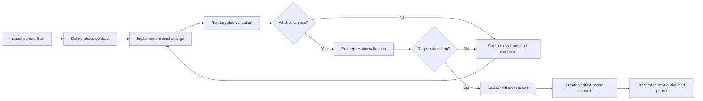
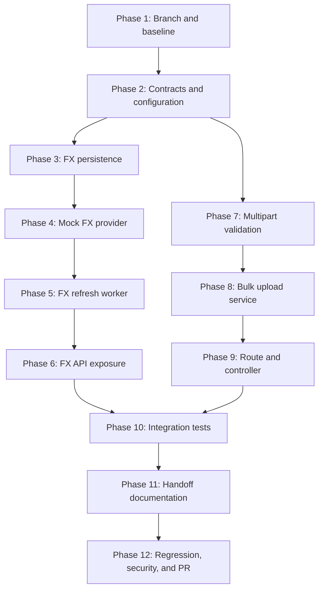
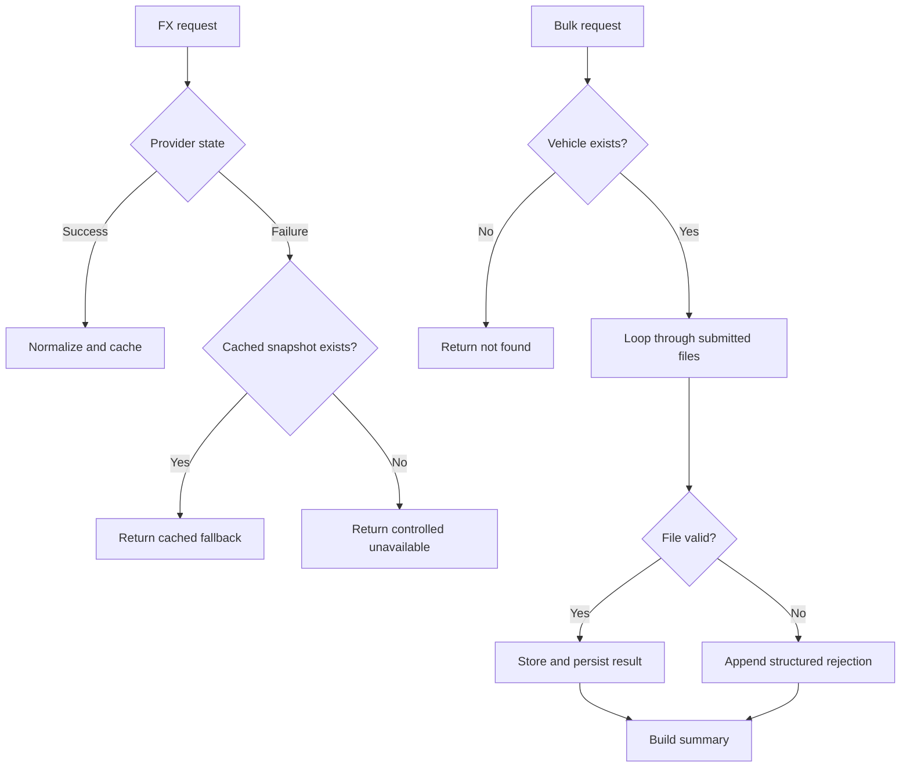

# Sprint 9 Backend Integration Development Timeline

## Ownership and delivery scope

**Owner:** Edwin Kambale

Sprint 9 implements two backend integration boundaries using deterministic mock data where production provider credentials or integration-owner infrastructure is pending:

1. A resilient foreign-exchange-rate worker with persistence, refresh control, and cached fallback.
2. A secure multipart batch image-upload engine exposed through `POST /api/cars/:id/images/bulk`.

The integration owner can replace the mock provider adapters during pull-request review without requiring changes to the domain contracts, validation rules, worker orchestration, or API response schemas.

## Delivery rules

- Inspect every existing target file before modification.
- Preserve the established Express, Mongoose, middleware, controller, service, configuration, and test conventions.
- Implement on a dedicated Sprint 9 feature branch only after the Sprint 8 worktree is clean or safely isolated.
- Never commit secrets or real production provider values.
- Use deterministic mock rates and mock storage/provider boundaries.
- Save every terminal command batch and its complete output as a descriptively named `.txt` file directly in `/home/trovas/Downloads/projects/byupw/block3_2026/CAR_DEALERSHIP/`.
- Run targeted tests first, followed by complete backend regression validation.
- Create a verified Git commit only after each development phase passes its gate.
- Stop when a gate fails. Diagnose and apply the smallest reversible correction before continuing.

## Development loop



## Integration dependency graph



---

## Phase 1: Worktree isolation, branch creation, and baseline verification

### Objectives

- Verify the current branch, worktree, remotes, and recent commits.
- Safely complete, commit, or isolate remaining Sprint 8 changes before creating the Sprint 9 branch.
- Pull the latest approved remote base without overwriting collaborator work.
- Create a dedicated Sprint 9 feature branch.
- Run the existing backend test and lint baseline before implementation.

### Files to create

- `docs/sprint9/sprint9-development-timeline.md`

### Files to modify

- None outside the Sprint 9 timeline during this phase.

### Validation gate

- Working tree is clean before branch creation.
- Dedicated Sprint 9 branch is active.
- Existing backend baseline commands pass.
- No Sprint 8 uncommitted work is carried accidentally into Sprint 9.

### Evidence file

- `/home/trovas/Downloads/projects/byupw/block3_2026/CAR_DEALERSHIP/sprint9_phase1_branch_baseline_validation.txt`

---

## Phase 2: Shared contracts, mock configuration, and integration boundaries

### Objectives

- Define normalized exchange-rate records independently of any vendor response shape.
- Define a provider interface so the integration owner can replace the mock provider.
- Define the bulk-upload request and per-file result contract.
- Add non-secret environment-variable names and safe mock defaults.
- Define stable error codes, file statuses, refresh states, and provider states.

### Files to create

- `backend/contracts/exchangeRate.contract.js`
- `backend/contracts/bulkImageUpload.contract.js`
- `backend/config/exchangeRates.js`
- `docs/sprint9/bulk-image-upload-api-contract.md`

### Files to modify

- `backend/.env.example`
- `backend/config/index.js`
- `backend/package.json`, only if inspection proves an additional dependency or script is required.

### Validation gate

- Contract modules load without syntax errors.
- Mock defaults contain no credentials.
- Enumerated statuses and error codes are immutable and testable.
- Existing configuration loading remains compatible.

### Evidence file

- `/home/trovas/Downloads/projects/byupw/block3_2026/CAR_DEALERSHIP/sprint9_phase2_contract_configuration_validation.txt`

---

## Phase 3: Exchange-rate persistence and cached-rate repository

### Objectives

- Add a Mongoose model for normalized rate snapshots.
- Store base currency, quote rates, provider identity, retrieval time, expiry time, and freshness state.
- Add indexes supporting latest-snapshot retrieval and controlled cleanup if required.
- Implement repository operations for saving fresh rates and reading the latest usable cached snapshot.
- Prevent invalid, empty, non-finite, zero, or negative rates from entering the cache.

### Files to create

- `backend/models/ExchangeRateSnapshot.js`
- `backend/repositories/exchangeRateRepository.js`
- `backend/tests/unit/repositories/exchangeRateRepository.test.js`

### Files to modify

- `backend/config/indexes.js`

### Validation gate

- Valid normalized snapshots persist and can be read back.
- Invalid snapshots are rejected.
- Latest-cache lookup is deterministic.
- Required indexes are registered without changing unrelated models.

### Evidence file

- `/home/trovas/Downloads/projects/byupw/block3_2026/CAR_DEALERSHIP/sprint9_phase3_exchange_rate_persistence_validation.txt`

---

## Phase 4: Deterministic mock foreign-exchange provider

### Objectives

- Implement the provider adapter interface with deterministic mock rates.
- Provide realistic mock currencies required by the application, including the configured base currency.
- Support controlled success, timeout, malformed response, and provider-unavailable scenarios.
- Normalize provider output before data reaches persistence or API layers.
- Keep the replacement boundary clear for the integration owner.

### Files to create

- `backend/services/exchangeRates/exchangeRateProvider.js`
- `backend/services/exchangeRates/mockExchangeRateProvider.js`
- `backend/services/exchangeRates/normalizeExchangeRates.js`
- `backend/tests/unit/services/mockExchangeRateProvider.test.js`
- `backend/tests/unit/services/normalizeExchangeRates.test.js`

### Files to modify

- `backend/config/exchangeRates.js`

### Validation gate

- Mock success returns a stable normalized contract.
- Failure simulations are deterministic.
- Malformed rates never pass normalization.
- No network access or production credentials are required.

### Evidence file

- `/home/trovas/Downloads/projects/byupw/block3_2026/CAR_DEALERSHIP/sprint9_phase4_mock_fx_provider_validation.txt`

---

## Phase 5: Exchange-rate refresh service and scheduled worker

### Objectives

- Implement refresh orchestration around provider retrieval, normalization, and persistence.
- Avoid unnecessary provider calls by honoring refresh intervals and cached freshness.
- Fall back to the latest cached snapshot when the provider fails.
- Return a controlled unavailable result only when both provider and cache are unavailable.
- Start and stop the worker cleanly with the application lifecycle.
- Prevent overlapping refresh executions.

### Files to create

- `backend/services/exchangeRates/exchangeRateService.js`
- `backend/workers/exchangeRateRefreshWorker.js`
- `backend/tests/unit/services/exchangeRateService.test.js`
- `backend/tests/unit/workers/exchangeRateRefreshWorker.test.js`

### Files to modify

- `backend/server.js` or the inspected active backend entrypoint.
- `backend/config/exchangeRates.js`
- `backend/package.json`, only if the existing scheduler convention requires a verified dependency or script.

### Validation gate

- Fresh cache suppresses unnecessary provider calls.
- Stale cache triggers a refresh.
- Provider success persists a fresh snapshot.
- Provider failure returns the latest cached snapshot.
- Concurrent ticks do not create overlapping refreshes.
- Worker shutdown leaves no active timer or open handle.

### Evidence file

- `/home/trovas/Downloads/projects/byupw/block3_2026/CAR_DEALERSHIP/sprint9_phase5_exchange_rate_worker_validation.txt`

---

## Phase 6: Exchange-rate API exposure

### Objectives

- Expose normalized rates through the established API routing conventions.
- Return source, freshness, retrieval time, base currency, and normalized rates.
- Distinguish fresh-provider, fresh-cache, stale-cache fallback, and unavailable outcomes.
- Preserve existing authentication and error-handling conventions where applicable.
- Provide a stable response for the frontend localized-currency widget.

### Files to create

- `backend/controllers/exchangeRateController.js`
- `backend/routes/exchangeRateRoutes.js`
- `backend/tests/integration/exchangeRateRoutes.test.js`

### Files to modify

- `backend/server.js` or the inspected active route-registration file.
- `backend/services/exchangeRates/exchangeRateService.js`

### Validation gate

- Successful and fallback responses match the shared contract.
- Unavailable state returns a controlled HTTP response.
- Provider exceptions never crash the process.
- Existing API routes remain operational.

### Evidence file

- `/home/trovas/Downloads/projects/byupw/block3_2026/CAR_DEALERSHIP/sprint9_phase6_exchange_rate_api_validation.txt`

---

## Phase 7: Multipart parser and server-side upload validation

### Objectives

- Configure multipart parsing for multiple vehicle images.
- Enforce permitted multipart field names, maximum file count, and per-file size limits.
- Validate MIME type and extension at the backend security boundary.
- Sanitize original filenames and reject malformed requests safely.
- Map parser errors into stable API error codes.

### Files to create

- `backend/middleware/bulkImageUpload.js`
- `backend/utils/validateImageUpload.js`
- `backend/tests/unit/middleware/bulkImageUpload.test.js`
- `backend/tests/unit/utils/validateImageUpload.test.js`

### Files to modify

- `backend/config/index.js`
- `backend/.env.example`
- `backend/package.json`, only if the inspected repository does not already provide multipart parsing.

### Validation gate

- Allowed images pass.
- Unsupported MIME types and extensions fail.
- Oversized files and excessive file counts fail predictably.
- Unexpected multipart fields fail predictably.
- Filename sanitization prevents unsafe path input.

### Evidence file

- `/home/trovas/Downloads/projects/byupw/block3_2026/CAR_DEALERSHIP/sprint9_phase7_multipart_validation.txt`

---

## Phase 8: Batch image-upload processing service

### Objectives

- Process accepted files through the established image-storage abstraction.
- Associate every stored image with the target vehicle.
- Preserve `clientFileId` correlation for Ronald's frontend queue.
- Return one structured result per submitted file.
- Support partial success without hiding file-level failures.
- Roll back or clean up orphaned storage objects when database persistence fails.

### Files to create

- `backend/services/bulkCarImageUploadService.js`
- `backend/tests/unit/services/bulkCarImageUploadService.test.js`

### Files to modify

- The inspected existing image-storage service or adapter file, only if a batch-safe method is genuinely required.
- The inspected existing car or vehicle model, only if image metadata cannot already be represented.

### Validation gate

- Each accepted file receives a stable result.
- One rejected file does not erase successful file results.
- Vehicle-not-found is handled before permanent storage where possible.
- Storage or database failure produces controlled cleanup behavior.
- Response ordering and `clientFileId` mapping are deterministic.

### Evidence file

- `/home/trovas/Downloads/projects/byupw/block3_2026/CAR_DEALERSHIP/sprint9_phase8_bulk_upload_service_validation.txt`

---

## Phase 9: Bulk vehicle-image endpoint

### Objectives

- Implement `POST /api/cars/:id/images/bulk`.
- Apply the project's existing authentication and administrator authorization middleware.
- Connect multipart parsing, validation, controller orchestration, service processing, and error handling.
- Return summary counts and structured per-file results.
- Use contract-appropriate HTTP statuses for complete success, partial success, request rejection, missing vehicle, and server failure.

### Files to create

- `backend/controllers/bulkCarImageController.js`
- `backend/tests/integration/bulkCarImageRoutes.test.js`

### Files to modify

- The inspected existing car route file.
- The inspected active backend route-registration file, only if required.
- `backend/contracts/bulkImageUpload.contract.js`

### Validation gate

- Endpoint route and middleware order are correct.
- Authentication and authorization remain enforced.
- Complete success, partial success, complete rejection, and vehicle-not-found paths match the contract.
- Malformed multipart requests never crash the application.

### Evidence file

- `/home/trovas/Downloads/projects/byupw/block3_2026/CAR_DEALERSHIP/sprint9_phase9_bulk_upload_endpoint_validation.txt`

---

## Phase 10: Cross-feature integration and failure-path test graph

### Objectives

- Validate both deliverables through unit and integration suites.
- Test provider/cache combinations and multipart/file combinations using loop-driven test matrices.
- Verify that new scheduler behavior does not leave open handles.
- Run existing backend regression tests after targeted suites pass.

### Test matrix graph



### Files to create

- `backend/tests/fixtures/exchangeRateFixtures.js`
- `backend/tests/fixtures/bulkImageUploadFixtures.js`
- `backend/tests/integration/sprint9FailurePaths.test.js`

### Files to modify

- Existing backend test setup or teardown file, only where the inspected framework requires worker and database cleanup.
- `backend/package.json`, only if test scripts need a verified additive update.

### Validation gate

- Every targeted unit suite passes.
- Every targeted integration suite passes.
- Complete existing backend regression suite passes.
- No open handles, uncaught rejections, secret leaks, or unexpected network calls occur.

### Evidence file

- `/home/trovas/Downloads/projects/byupw/block3_2026/CAR_DEALERSHIP/sprint9_phase10_full_backend_regression_validation.txt`

---

## Phase 11: Frontend and integration-owner handoff documentation

### Objectives

- Finalize Ronald's multipart contract and correlation rules.
- Clearly separate client-measured transport progress from backend processing results.
- Document mock FX behavior and the provider replacement seam.
- Document environment names without values.
- Provide request and response examples for success, partial success, rejection, fallback, and unavailable states.
- Record known limitations and integration-owner follow-up actions.

### Files to create

- `docs/sprint9/exchange-rate-integration-handoff.md`
- `docs/sprint9/bulk-image-upload-integration-handoff.md`
- `docs/sprint9/sprint9-dependency-register.md`
- `docs/sprint9/sprint9-validation-report.md`

### Files to modify

- `docs/sprint9/bulk-image-upload-api-contract.md`
- `README.md`, only if the existing documentation convention requires a Sprint 9 setup reference.

### Validation gate

- Documented schemas match tested runtime responses.
- Mock values are explicitly labeled.
- Integration-owner replacement steps do not require rewriting domain logic.
- Ronald can map every `clientFileId` to one backend file result.

### Evidence file

- `/home/trovas/Downloads/projects/byupw/block3_2026/CAR_DEALERSHIP/sprint9_phase11_handoff_documentation_validation.txt`

---

## Phase 12: Security review, final regression, verified commits, and pull-request preparation

### Objectives

- Review the complete Sprint 9 diff.
- Scan tracked changes for secrets, generated files, accidental uploads, and unrelated Sprint 8 content.
- Re-run targeted and full backend validation from the Sprint 9 branch.
- Verify documentation, mock-data labelling, route protection, fallback behavior, upload limits, and cleanup behavior.
- Create the final verified phase commit.
- Push the feature branch and prepare the pull request for integration-owner review and merge.
- Do not merge directly into `main`.

### Files to create

- `docs/sprint9/sprint9-pr-summary.md`
- `docs/sprint9/sprint9-security-review.md`
- `docs/sprint9/sprint9-deployment-handoff.md`
- `docs/sprint9/sprint9-rollback-plan.md`

### Files to modify

- `.gitignore`, only if inspection proves new generated artifacts require exclusion.
- Sprint 9 documentation files where final verified command output changes status statements.

### Validation gate

- Git diff contains only approved Sprint 9 changes.
- Secret scan passes.
- Targeted tests pass.
- Full backend regression passes.
- Expected completion marker prints.
- Feature branch push succeeds.
- Pull request is ready for administrator or integration-owner review.
- No direct merge into `main` is performed.

### Evidence file

- `/home/trovas/Downloads/projects/byupw/block3_2026/CAR_DEALERSHIP/sprint9_phase12_final_pr_readiness_validation.txt`

---

## Planned API result shape

```json
{
  "carId": "car-123",
  "summary": {
    "received": 3,
    "uploaded": 2,
    "rejected": 1,
    "failed": 0
  },
  "files": [
    {
      "clientFileId": "file-001",
      "fileName": "front-view.jpg",
      "status": "uploaded",
      "mimeType": "image/jpeg",
      "size": 284113,
      "imageId": "image-901",
      "url": "/uploads/cars/car-123/front-view.jpg",
      "error": null
    },
    {
      "clientFileId": "file-002",
      "fileName": "vehicle-document.pdf",
      "status": "rejected",
      "mimeType": "application/pdf",
      "size": 92561,
      "imageId": null,
      "url": null,
      "error": {
        "code": "UNSUPPORTED_MIME_TYPE",
        "message": "Only approved image formats are accepted."
      }
    }
  ]
}
```

## Definition of done

Sprint 9 is complete only when:

- The mock FX provider, normalization, persistence, refresh suppression, scheduled refresh, and cached fallback paths are implemented and tested.
- `POST /api/cars/:id/images/bulk` is authenticated, authorized, validated, and tested.
- The endpoint returns deterministic per-file results supporting partial success.
- Ronald's frontend handoff contract matches tested backend behavior.
- Integration-owner replacement seams are documented.
- No secrets or production credentials are committed.
- All targeted and full backend validation commands pass without hidden failures.
- Every phase has a verified Git commit and saved terminal evidence.
- The feature branch is pushed and submitted through a pull request for review.
- The integration owner, not the implementation branch, performs the approved merge.
