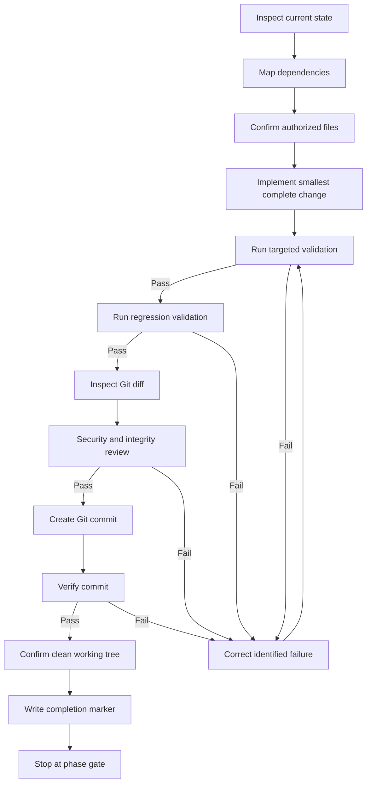
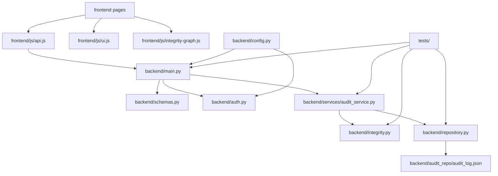
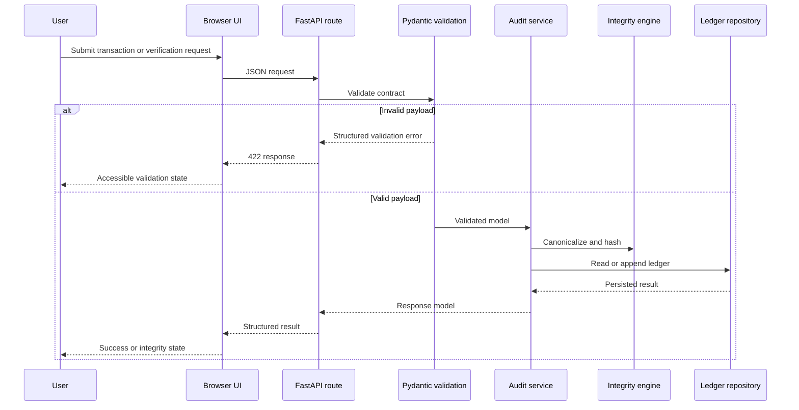
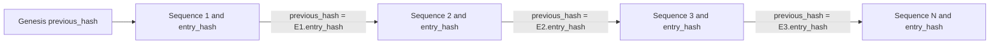
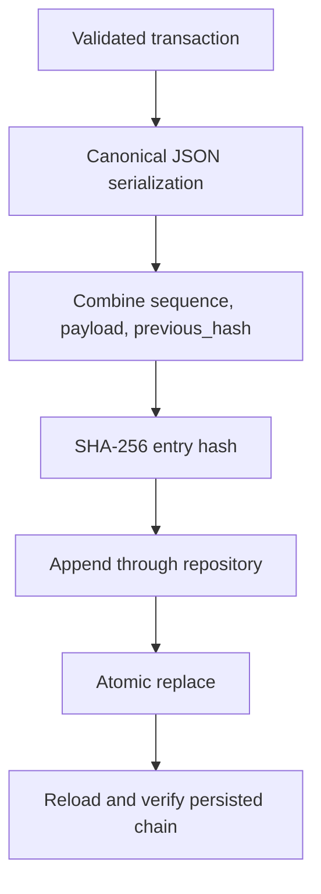
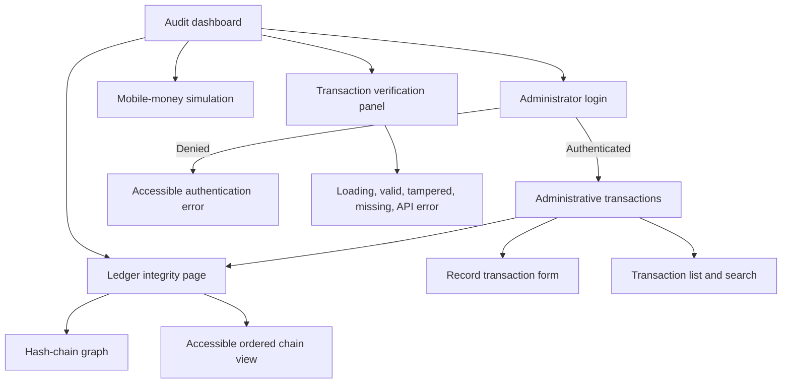
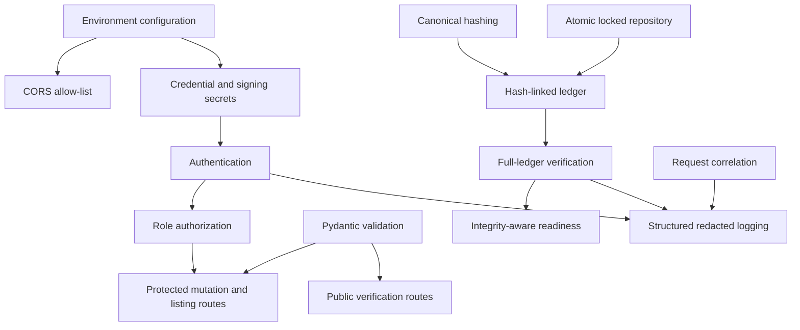

# Audit Verification System Development Timeline

**Document status:** Implementation-ready planning baseline  
**Repository:** `/home/trovas/Downloads/projects/byupw/Audit_verification_sys`  
**Timeline deliverable:** `AUDIT_VERIFICATION_SYSTEM_DEVELOPMENT_TIMELINE.md`  
**Execution status:** Planning only. No implementation is authorized by this document.  
**Last planning revision:** 10 September 2026

---

## 1. Purpose

This timeline converts the verified repository, source, runtime, architecture, and security inspection findings into approval-gated development phases. It prioritizes an early professional user interface while building every visible capability as part of a tested end-to-end vertical slice connected to validated APIs, tamper-evident ledger controls, and failure-safe persistence.

The timeline enforces exact file authorization, inspection before modification, targeted validation, regression testing, Git diff review, a verified commit at every completed phase, a clean working tree, and an explicit stop before the next phase.

---

## 2. Verified Starting Point

### 2.1 Current repository structure

Existing tracked implementation files identified during inspection:

- `README.md`
- `backend/main.py`
- `backend/audit_repo/audit_log.json`
- `frontend/index.html`
- `frontend/app.js`
- `frontend/login.html`
- `frontend/login.js`
- `frontend/transactions.html`
- `frontend/transactions.js`
- `frontend/style.css`

Baseline files created during the incomplete baseline setup:

- `.gitignore`
- `requirements.txt`
- `requirements-dev.txt`

### 2.2 Verified strengths

- The backend source passes Python syntax validation.
- A FastAPI application is already present.
- Transaction recording, mobile-money simulation, individual verification, and transaction-list endpoints exist.
- A Python virtual environment was created successfully.
- FastAPI, Pydantic, Uvicorn, HTTPX, and Pytest were installed and imported successfully inside `.venv`.
- Generated Python bytecode and the virtual environment are covered by ignore rules.

### 2.3 Verified gaps and flaws

#### Development baseline

- The baseline Git commit was not created because the staging command referenced a bytecode file already registered for deletion by `git rm`.
- The baseline completion marker therefore failed.
- The repository cannot yet be treated as cleanly baselined.

#### Backend integrity

- API request bodies use unrestricted dictionaries instead of validated schemas.
- Required fields, lengths, formats, numeric bounds, and extra properties are not enforced.
- Hashing uses direct string concatenation rather than canonical serialization.
- Records contain independent hashes but no `previous_hash`, sequence continuity, or ledger-wide chain.
- Individual verification does not prove full-ledger integrity.
- Direct JSON overwrite is vulnerable to partial writes and interruption.
- Concurrent writes are not coordinated.
- Corrupted or structurally invalid ledger content has no controlled recovery response.
- Storage paths depend on the process working directory.

#### Security and authorization

- Administrative credentials are hard-coded in browser JavaScript.
- Administrative authorization exists only in `sessionStorage` and is client-enforced.
- Backend administrative endpoints are directly callable without authentication.
- CORS accepts every origin, method, and header while credentials are enabled.
- Secrets and environment-specific configuration are not centrally managed.
- No role or permission model is enforced by the backend.
- Sensitive data exposure and security-event recording controls are absent.

#### Frontend

- The interface lacks a defined design system and reusable UI primitives.
- API URLs are duplicated and hard-coded.
- API failure responses are frequently rendered as if requests succeeded.
- Transaction values are interpolated through `innerHTML`, creating an injection risk.
- Loading, empty, validation, success, degraded, and integrity-failure states are incomplete.
- Accessibility semantics, keyboard behavior, focus handling, and screen-reader announcements are not defined.
- The stylesheet references `background.jpg`, which was not discovered in the repository inspection.
- Responsive behavior is minimal.

#### Testing and operations

- No automated tests were discovered.
- No test fixtures, temporary-ledger isolation, or API contract tests exist.
- No structured logging, health endpoints, readiness checks, request correlation, or operational runbook exists.
- No continuous-integration workflow was identified.
- The existing `README.md` is empty.

---

## 3. Mandatory Development Rules

### 3.1 Phase execution loop

Every phase must use this loop without skipping a gate:

### 3.2 Stop conditions

Execution must stop when any of the following occurs:

1. A required validation fails and cannot be corrected from current evidence.
2. A blocker requires user-provided evidence or a product decision.
3. An unlisted file or dependency becomes necessary.
4. The phase passes, receives a verified Git commit, and reaches its completion marker.

### 3.3 Unlisted dependency protocol

If an unlisted file becomes necessary:

1. Do not modify or create it.
2. Record its exact path and the reason it is required.
3. Inspect its current structure if it exists.
4. Map direct dependants and dependencies.
5. Update the phase authorization list.
6. Resume only after the authorization boundary is explicit.

### 3.4 Git completion rule

A phase is complete only when:

- Targeted validation passes.
- Regression validation passes.
- `git diff --check` passes.
- Only authorized files have changed.
- The required commit is created.
- `git log -1` confirms the expected commit subject.
- `git status --porcelain` is empty.
- The phase completion marker is printed and captured in its evidence file.

### 3.5 Evidence directory

All terminal evidence must be saved under:

`/home/trovas/Downloads/projects/byupw/block4_2026/KENNY/SCRIPTS/`

---

## 4. Overall Phase Dependency Graph

---

## 5. File and Module Dependency Graph

---

## 6. Frontend-to-Backend Request Flow

---

## 7. Transaction and Audit Chain Model

---

# 8. Development Phases

## Prerequisite Gate: Repair and Verify the Development Baseline

### Objective

Produce one verified baseline commit containing dependency manifests, repository hygiene rules, and removal of tracked generated bytecode, with a clean working tree.

### Gap addressed

The baseline validations passed, but staging failed and no commit was created.

### Expected outcome

- `.gitignore`, `requirements.txt`, and `requirements-dev.txt` are tracked.
- `backend/__pycache__/main.cpython-312.pyc` is removed from Git.
- `.venv` remains ignored.
- All required packages import successfully.
- A verified Git commit exists.

### Entry conditions

- Repository remains at or descends directly from inspected commit `c442dbf7f7b6ca1997318f59ffb2c0aa67f48bd0`.
- Current status is inspected before any action.
- Existing baseline files are inspected before staging.

### Dependencies

None. This is the prerequisite for implementation.

### Existing files to inspect

- `.gitignore`
- `requirements.txt`
- `requirements-dev.txt`
- `backend/main.py`
- Git index and working-tree status

### Existing files exclusively authorized for modification

- `.gitignore`, only if inspection proves the generated-file rules are incomplete
- `requirements.txt`, only if installed versions conflict with the declared ranges
- `requirements-dev.txt`, only if installed versions conflict with the declared ranges

### New files exclusively authorized for creation

None.

### Authorized deletion

- `backend/__pycache__/main.cpython-312.pyc` from Git tracking

### Files prohibited from modification

- `backend/main.py`
- `backend/audit_repo/audit_log.json`
- Every file under `frontend/`
- `README.md`

### Affected controls

- Virtual environment reproducibility
- Dependency declaration
- Generated-file hygiene
- Git baseline integrity

### Exact implementation steps

1. Inspect `git status --short`, `git diff`, and `git diff --cached`.
2. Inspect the three baseline files.
3. Confirm the tracked bytecode deletion is already staged or stage all intended baseline changes with exact paths that still exist plus `git add -u -- backend/__pycache__`.
4. Validate `.venv` and bytecode ignore rules.
5. Validate imports from `.venv`.
6. Compile `backend/main.py` without tracking generated output.
7. Run `git diff --cached --check`.
8. Verify the staged path set contains only the authorized baseline changes.
9. Commit and verify.
10. Confirm a clean working tree.

### Targeted validation

- `.venv/bin/python -c "import fastapi, pydantic, uvicorn, httpx, pytest"`
- `.venv/bin/python -m py_compile backend/main.py`
- `git check-ignore -q .venv/bin/python`
- `git check-ignore -q backend/__pycache__/main.cpython-313.pyc`
- `git diff --cached --check`

### Regression validation

- Import `backend/main.py` from the backend working directory.
- Confirm application title and version remain available.
- Confirm no frontend or ledger data file changed.

### Security and integrity checks

- No secret file is staged.
- No virtual environment content is staged.
- Ledger data is unchanged.

### Completion marker

`AUDIT_VERIFICATION_DEVELOPMENT_BASELINE_COMPLETE`

### Evidence filename

`audit-verification-development-baseline-repair-and-commit.txt`

### Git commit subject

`chore: establish Python development baseline`

### Commit verification

- `git log -1 --format='%H%n%s'` shows the new commit and exact subject.
- `git show --name-status --format=fuller HEAD` contains only authorized changes.
- `git status --porcelain` is empty.

### Exit conditions

All checks pass, the commit exists, and the working tree is clean.

### Next queued phase

UI foundation and design system.

---

## Phase 1: Professional Responsive UI Foundation

### Objective

Deliver a polished, responsive, accessible application shell and design system without claiming unimplemented backend capabilities.

### Gap addressed

The current frontend is visually basic, has duplicated inline behaviors, incomplete states, minimal accessibility, and a missing background asset reference.

### Expected outcome

A consistent dashboard, verification page, administrator page shell, navigation system, responsive layout, reusable status components, and clearly labelled demonstration data where necessary.

### Entry conditions

- Prerequisite baseline gate is complete.
- All existing frontend files have been inspected again.
- Browser behavior and current element identifiers are mapped.

### Dependencies

Prerequisite gate.

### Existing files to inspect

- `frontend/index.html`
- `frontend/login.html`
- `frontend/transactions.html`
- `frontend/app.js`
- `frontend/login.js`
- `frontend/transactions.js`
- `frontend/style.css`

### Existing files exclusively authorized for modification

- `frontend/index.html`
- `frontend/login.html`
- `frontend/transactions.html`
- `frontend/app.js`
- `frontend/login.js`
- `frontend/transactions.js`
- `frontend/style.css`

### New files exclusively authorized for creation

- `frontend/js/config.js`
- `frontend/js/ui.js`
- `frontend/assets/.gitkeep`
- `tests/frontend/test_frontend_structure.py`

### Files prohibited from modification

- `backend/main.py`
- `backend/audit_repo/audit_log.json`
- `requirements.txt`
- `requirements-dev.txt`

### Affected components

- Application header and navigation
- Dashboard summary cards
- Verification form
- Mobile-money simulation form presentation
- Administrative transaction page shell
- Status banners and inline messages
- Responsive transaction table container

### Exact implementation steps

1. Map existing DOM identifiers and JavaScript bindings.
2. Define CSS custom properties for color, spacing, typography, elevation, focus, and breakpoints.
3. Remove the unresolved `background.jpg` dependency and use a CSS-native background.
4. Add semantic page landmarks, headings, labels, descriptions, and live status regions.
5. Build reusable CSS classes for buttons, inputs, cards, badges, alerts, tables, skeletons, and empty states.
6. Create `frontend/js/config.js` as the single API base URL and mock-state configuration source.
7. Create `frontend/js/ui.js` for safe text rendering, state switching, and accessible announcements.
8. Preserve existing feature claims only where current APIs exist.
9. Mark mobile-money behavior as simulation.
10. Add structural tests for required landmarks, labels, scripts, and absence of the missing background reference.

### UI states required

- Initial
- Loading
- Empty
- Success
- Validation failure
- API failure
- Integrity warning placeholder, labelled unavailable until the integrity API exists

### Mock-data rule

Dashboard summary values may use centrally defined demonstration values only through `frontend/js/config.js`. Each must display a “Demonstration data” label and must be replaced during Phase 7.

### Responsive requirements

- Usable from 320px width upward.
- Navigation remains keyboard accessible.
- Tables use controlled horizontal scrolling on narrow screens.
- Forms become single-column on narrow screens.
- Touch targets are at least 44 by 44 CSS pixels.

### Accessibility requirements

- Visible focus indicators.
- Programmatic form labels.
- `aria-live` status regions.
- No color-only status communication.
- Logical heading order.
- Keyboard-operable navigation and controls.

### Targeted validation

- Run `pytest -q tests/frontend/test_frontend_structure.py`.
- Parse every HTML file successfully.
- Confirm all referenced local CSS and JavaScript files exist.
- Confirm `background.jpg` is not referenced.
- Confirm no inline hard-coded API URL remains outside `config.js`.

### Regression validation

- Existing page paths remain usable.
- Existing form identifiers required by current JavaScript remain present or are updated consistently.
- Backend source and ledger file remain byte-for-byte unchanged.

### Security and integrity checks

- Dynamic messages use `textContent`, not `innerHTML`.
- No new credentials or secrets are introduced.
- Mock values are visibly labelled.

### Visual validation

Capture desktop and mobile screenshots for all three pages and inspect overflow, focus visibility, status contrast, and empty/error states.

### Functional validation

Serve the frontend locally and confirm navigation, form validation, state transitions, and safe error rendering.

### Completion marker

`AUDIT_VERIFICATION_UI_FOUNDATION_COMPLETE`

### Evidence filename

`audit-verification-ui-foundation-validation.txt`

### Git commit subject

`feat: establish responsive audit interface foundation`

### Commit verification

Verify exact subject, authorized changed paths, and clean working tree.

### Exit conditions

The UI shell is responsive, accessible, structurally tested, and does not imply unavailable functionality.

### Next queued phase

Validated backend schemas and explicit API contracts.

---

## Phase 2: Validated Transaction Schemas and API Contracts

### Objective

Replace unrestricted request and response dictionaries with explicit Pydantic models and stable API contracts.

### Gap addressed

Malformed, incomplete, negative, empty, or unexpected transaction fields can currently enter the ledger.

### Expected outcome

Administrative and simulated mobile-money requests receive deterministic validation; endpoints return typed response models and controlled errors.

### Entry conditions

- Phase 1 is complete.
- Current backend endpoint signatures and ledger fields are inspected.
- Existing sample ledger values are profiled without modification.

### Dependencies

Prerequisite gate and Phase 1.

### Existing files to inspect

- `backend/main.py`
- `backend/audit_repo/audit_log.json`
- `requirements.txt`
- `frontend/app.js`
- `frontend/transactions.js`

### Existing files exclusively authorized for modification

- `backend/main.py`

### New files exclusively authorized for creation

- `backend/__init__.py`
- `backend/schemas.py`
- `tests/__init__.py`
- `tests/conftest.py`
- `tests/backend/test_schemas.py`
- `tests/api/test_validation.py`

### Files prohibited from modification

- `backend/audit_repo/audit_log.json`
- Every file under `frontend/`
- Dependency manifests

### Affected objects

- `TransactionCreate`
- `MobileTransactionCreate`
- `TransactionRecord`
- `TransactionResponse`
- `TransactionListResponse`
- `/record`
- `/record_mobile`
- `/verify/{transaction_id}`
- `/transactions`

### Exact implementation steps

1. Define normalized string constraints and positive finite monetary constraints.
2. Reject unknown fields using strict model configuration.
3. Represent money without binary floating-point ambiguity in internal models.
4. Add response models matching current user-visible data.
5. Update route signatures without changing storage behavior yet.
6. Add isolated test-ledger configuration through fixtures or dependency overrides.
7. Test missing, blank, malformed, negative, non-finite, oversized, and extra fields.
8. Test duplicate transaction behavior remains controlled.

### Targeted validation

- `pytest -q tests/backend/test_schemas.py tests/api/test_validation.py`
- Verify OpenAPI schemas for all four endpoints.

### Regression validation

- Valid legacy-shaped transaction requests still receive successful responses.
- Existing sample ledger file remains unchanged.
- UI structural tests pass.

### Security and integrity checks

- Extra fields are rejected.
- Error responses do not expose stack traces or filesystem paths.
- Transaction identifiers are length and character constrained.

### Completion marker

`AUDIT_VERIFICATION_SCHEMA_CONTRACTS_COMPLETE`

### Evidence filename

`audit-verification-schema-api-contracts-validation.txt`

### Git commit subject

`feat: validate transaction API contracts`

### Commit verification

Verify exact subject, authorized paths, passing tests, and clean tree.

### Exit conditions

All request and response contracts are explicit and tested.

### Next queued phase

Canonical deterministic hashing.

---

## Phase 3: Deterministic Canonical Hashing

### Objective

Guarantee identical hashes for semantically identical ledger entries through a documented canonical representation.

### Gap addressed

Current delimiter-based string concatenation is fragile and does not define encoding, numeric normalization, key ordering, or serialization rules.

### Expected outcome

One integrity module produces deterministic SHA-256 hashes from normalized ledger data.

### Entry conditions

- Phase 2 is complete.
- Schema serialization behavior is inspected.
- Existing sample entries and hashes are captured as migration evidence.

### Dependencies

Phase 2.

### Existing files to inspect

- `backend/main.py`
- `backend/schemas.py`
- `backend/audit_repo/audit_log.json`
- `tests/backend/test_schemas.py`

### Existing files exclusively authorized for modification

- `backend/main.py`
- `backend/schemas.py`

### New files exclusively authorized for creation

- `backend/integrity.py`
- `tests/backend/test_integrity.py`
- `docs/CANONICAL_HASH_SPECIFICATION.md`

### Files prohibited from modification

- `backend/audit_repo/audit_log.json`
- Every file under `frontend/`

### Affected functions and models

- `canonicalize_entry`
- `compute_entry_hash`
- Hashable transaction payload schema
- Existing `compute_hash` call sites

### Exact implementation steps

1. Define the exact included fields and excluded derived fields.
2. Normalize timestamps, transaction identifiers, text, method, and decimal amount representation.
3. Serialize as UTF-8 JSON with sorted keys and fixed separators.
4. Compute lowercase SHA-256 hexadecimal output.
5. Preserve legacy hash verification behind an explicit compatibility function only until migration.
6. Add golden-vector tests and property-oriented ordering tests.
7. Document the canonical format byte-for-byte.

### Targeted validation

- `pytest -q tests/backend/test_integrity.py`
- Confirm the same logical payload in different dictionary orders produces the same hash.
- Confirm any included-field change produces a different hash.
- Confirm canonical output is stable across repeated runs.

### Regression validation

- Schema and API validation tests pass.
- Existing ledger remains unchanged.
- Application imports successfully.

### Security and integrity checks

- No secret key is falsely implied by plain SHA-256.
- Domain separation identifies the ledger format and version.
- Unicode and decimal normalization rules are tested.

### Completion marker

`AUDIT_VERIFICATION_CANONICAL_HASHING_COMPLETE`

### Evidence filename

`audit-verification-canonical-hashing-validation.txt`

### Git commit subject

`feat: add deterministic canonical transaction hashing`

### Commit verification

Verify exact subject, specification and tests included, and clean tree.

### Exit conditions

Canonical hashing is deterministic, documented, and fully tested.

### Next queued phase

Hash-linked ledger entries and migration.

---

## Phase 4: Hash-Linked Ledger and Controlled Migration

### Objective

Transform independent transaction records into a versioned, sequential, hash-linked audit chain while preserving existing data through a tested migration.

### Gap addressed

Independent hashes cannot reliably expose insertion, deletion, or reordering of records.

### Expected outcome

Every ledger entry has a schema version, sequence, previous hash, and entry hash; existing records are migrated deterministically with a backup.

### Entry conditions

- Phase 3 is complete.
- Existing ledger is backed up and verified before migration.
- Migration behavior is tested against a copied fixture, not the live ledger first.

### Dependencies

Phase 3.

### Existing files to inspect

- `backend/main.py`
- `backend/schemas.py`
- `backend/integrity.py`
- `backend/audit_repo/audit_log.json`
- `docs/CANONICAL_HASH_SPECIFICATION.md`

### Existing files exclusively authorized for modification

- `backend/main.py`
- `backend/schemas.py`
- `backend/integrity.py`
- `backend/audit_repo/audit_log.json`, only through the verified migration command

### New files exclusively authorized for creation

- `backend/migrate_ledger.py`
- `backend/audit_repo/audit_log.pre-chain.json`
- `tests/fixtures/legacy_audit_log.json`
- `tests/backend/test_ledger_migration.py`

### Files prohibited from modification

- Every file under `frontend/`
- Dependency manifests

### Affected fields and functions

- `schema_version`
- `sequence`
- `previous_hash`
- `entry_hash`
- `migrate_legacy_ledger`
- `verify_chain_links`

### Exact implementation steps

1. Define a fixed genesis previous-hash value.
2. Extend the record schema with chain fields.
3. Build a migration function that preserves original business data and timestamps.
4. Copy the original ledger to `audit_log.pre-chain.json` before live migration.
5. Refuse migration if the input structure is invalid or backup creation fails.
6. Chain migrated entries in original order.
7. Verify the complete migrated result before replacing the active ledger.
8. Make migration idempotent and refuse mixed-format ledgers.
9. Add tests for insertion, deletion, reordering, modified payloads, and repeated migration.

### Targeted validation

- `pytest -q tests/backend/test_ledger_migration.py tests/backend/test_integrity.py`
- Compare pre-migration and post-migration business fields.
- Verify every `previous_hash` equals the preceding `entry_hash`.

### Regression validation

- All prior tests pass.
- Both existing sample transactions remain discoverable.
- Original ledger backup hash is recorded in evidence.

### Security and integrity checks

- Backup is created before replacement.
- Migration never reports success after a partial failure.
- Sequence values are unique, contiguous, and ordered.

### Completion marker

`AUDIT_VERIFICATION_HASH_LINKED_LEDGER_COMPLETE`

### Evidence filename

`audit-verification-hash-linked-ledger-migration.txt`

### Git commit subject

`feat: migrate audit records to a hash-linked ledger`

### Commit verification

Verify the exact subject, backup and migrated ledger inclusion decision, tests, and clean tree.

### Exit conditions

The ledger is versioned, linked, migrated, backed up, and fully verified.

### Next queued phase

Atomic persistence and concurrency control.

---

## Phase 5: Atomic Persistence and Concurrency Control

### Objective

Prevent partial writes, lost updates, and path-dependent storage failures.

### Gap addressed

The current application directly overwrites a relative JSON file with no lock, flush, atomic replacement, or corruption guard.

### Expected outcome

A repository abstraction performs validated reads and lock-protected atomic writes using a stable absolute path.

### Entry conditions

- Phase 4 is complete.
- All read/write call sites are mapped.
- Filesystem behavior is tested in temporary directories.

### Dependencies

Phase 4.

### Existing files to inspect

- `backend/main.py`
- `backend/schemas.py`
- `backend/integrity.py`
- `backend/audit_repo/audit_log.json`
- `requirements.txt`

### Existing files exclusively authorized for modification

- `backend/main.py`
- `requirements.txt`
- `requirements-dev.txt`

### New files exclusively authorized for creation

- `backend/config.py`
- `backend/repository.py`
- `tests/backend/test_repository.py`
- `tests/backend/test_concurrency.py`

### Files prohibited from modification

- Active ledger business records
- Every file under `frontend/`

### Affected functions and classes

- `Settings`
- `AuditLedgerRepository`
- `load_entries`
- `append_entry`
- `atomic_write`
- Existing load/save functions, which are removed after call-site migration

### Exact implementation steps

1. Resolve the default ledger path relative to the backend module, not the shell working directory.
2. Allow test-specific path override through configuration.
3. Validate JSON shape and chain integrity on load.
4. Write to a same-directory temporary file.
5. Flush and `fsync` the temporary file.
6. Atomically replace the destination.
7. Synchronize directory metadata where supported.
8. Add inter-process or file locking appropriate to the declared single-host deployment.
9. Re-read and verify after commit.
10. Safely remove temporary files after failures.
11. Test interrupted writes, malformed JSON, simultaneous appends, and path independence.

### Targeted validation

- `pytest -q tests/backend/test_repository.py tests/backend/test_concurrency.py`
- Verify no orphan temporary files remain after simulated failure.
- Verify concurrent test writers do not lose successful entries.

### Regression validation

- Entire backend suite passes.
- Application imports from repository root and backend directory.
- Migrated ledger verifies without modification.

### Security and integrity checks

- Ledger permissions are inspected.
- Symlink and unexpected-path behavior is rejected or documented.
- Corruption produces a controlled failure and never silently initializes an empty ledger.

### Completion marker

`AUDIT_VERIFICATION_ATOMIC_PERSISTENCE_COMPLETE`

### Evidence filename

`audit-verification-atomic-persistence-concurrency.txt`

### Git commit subject

`feat: add atomic audit-ledger persistence`

### Commit verification

Verify exact subject, authorized files, full tests, and clean tree.

### Exit conditions

Persistence is atomic, path-stable, corruption-aware, and concurrency-tested.

### Next queued phase

Full-ledger integrity verification API.

---

## Phase 6: Full-Ledger Integrity Verification API

### Objective

Expose a deterministic API that verifies sequence continuity, every entry hash, every chain link, and the complete ledger result.

### Gap addressed

Current verification checks only one record hash and cannot prove full-ledger integrity.

### Expected outcome

The API reports validity, entries checked, first invalid entry, failure type, expected and recorded values, and ledger head hash.

### Entry conditions

- Phase 5 is complete.
- Repository and integrity interfaces are stable.

### Dependencies

Phases 3 through 5.

### Existing files to inspect

- `backend/main.py`
- `backend/schemas.py`
- `backend/integrity.py`
- `backend/repository.py`
- Existing backend tests

### Existing files exclusively authorized for modification

- `backend/main.py`
- `backend/schemas.py`
- `backend/integrity.py`

### New files exclusively authorized for creation

- `backend/services/__init__.py`
- `backend/services/audit_service.py`
- `tests/backend/test_audit_service.py`
- `tests/api/test_integrity_endpoints.py`

### Files prohibited from modification

- Active ledger data
- Every file under `frontend/`

### Affected endpoints and objects

- `GET /verify/{transaction_id}`
- `GET /integrity`
- `LedgerIntegrityResult`
- `EntryIntegrityResult`
- `AuditService`

### Exact implementation steps

1. Move recording and verification orchestration into `AuditService`.
2. Verify ledger schema version and sequence continuity.
3. Recompute each canonical entry hash.
4. Compare each previous-hash link.
5. Stop at and report the first invalid entry while retaining checked-count evidence.
6. Return ledger head hash and total entries when valid.
7. Make individual verification include both record validity and ledger-context validity.
8. Add API tests for valid, altered, deleted, reordered, malformed, and empty ledgers.

### Targeted validation

- `pytest -q tests/backend/test_audit_service.py tests/api/test_integrity_endpoints.py`
- Validate OpenAPI response schemas.

### Regression validation

- Entire backend suite passes.
- Current recording endpoints remain operational against temporary ledgers.

### Security and integrity checks

- Integrity errors do not disclose filesystem paths.
- Expected/recorded output is limited to hashes and sequence metadata.
- Verification never mutates the ledger.

### Completion marker

`AUDIT_VERIFICATION_LEDGER_INTEGRITY_API_COMPLETE`

### Evidence filename

`audit-verification-full-ledger-integrity-api.txt`

### Git commit subject

`feat: expose full-ledger integrity verification`

### Commit verification

Verify exact subject, endpoints, tests, and clean tree.

### Exit conditions

Every ledger-level corruption class in scope is detected and reported through a tested API.

### Next queued phase

End-to-end transaction recording UI slice.

---

## Phase 7: End-to-End Transaction Recording Vertical Slice

### Objective

Connect the polished interface to validated, canonicalized, atomically persisted transaction recording with truthful user states.

### Gap addressed

The current frontend assumes success, duplicates API URLs, and does not consistently process non-2xx responses.

### Expected outcome

Administrative and simulated mobile-money forms show loading, validation, duplicate, persistence-failure, and success states; successful records refresh real ledger summaries.

### Entry conditions

- Phase 6 is complete.
- Current frontend scripts and backend contracts are re-inspected.

### Dependencies

Phases 1, 2, 5, and 6.

### Existing files to inspect

- `frontend/index.html`
- `frontend/transactions.html`
- `frontend/app.js`
- `frontend/transactions.js`
- `frontend/js/config.js`
- `frontend/js/ui.js`
- `backend/main.py`
- `backend/schemas.py`

### Existing files exclusively authorized for modification

- `frontend/index.html`
- `frontend/transactions.html`
- `frontend/app.js`
- `frontend/transactions.js`
- `frontend/js/config.js`
- `frontend/js/ui.js`
- `frontend/style.css`
- `backend/main.py`, only for contract defects proven by integration tests

### New files exclusively authorized for creation

- `frontend/js/api.js`
- `tests/api/test_recording_workflow.py`
- `tests/frontend/test_recording_contract.py`

### Files prohibited from modification

- Integrity algorithms
- Repository atomic-write implementation
- Active ledger data during tests

### Affected components and endpoints

- Transaction form
- Mobile-money simulation form
- Summary cards
- Transaction table
- `POST /record`
- `POST /record_mobile`
- `GET /transactions`

### Exact implementation steps

1. Centralize `fetch` behavior, timeout handling, JSON parsing, and non-2xx errors in `api.js`.
2. Disable duplicate submissions while requests are active.
3. Render field-level 422 responses safely.
4. Render controlled duplicate and persistence errors.
5. Replace dashboard mock totals with real API-derived values.
6. Label mobile-money recording as simulation until provider integration exists.
7. Use DOM node creation and `textContent` for table values.
8. Add end-to-end API tests and frontend contract tests.

### Targeted validation

- `pytest -q tests/api/test_recording_workflow.py tests/frontend/test_recording_contract.py`
- Browser validation for all required UI states.

### Regression validation

- Full test suite passes.
- Existing navigation and responsive checks pass.
- Ledger integrity remains valid after every successful test append.

### Security and integrity checks

- No `innerHTML` interpolation of transaction data.
- No secret or PIN collection is introduced.
- Non-2xx responses cannot be displayed as success.

### Completion marker

`AUDIT_VERIFICATION_RECORDING_VERTICAL_SLICE_COMPLETE`

### Evidence filename

`audit-verification-recording-ui-integration.txt`

### Git commit subject

`feat: connect transaction recording interface`

### Commit verification

Verify exact subject, authorized paths, full tests, and clean tree.

### Exit conditions

Both recording flows are visually complete, contract-correct, safe-rendered, and integrity-preserving.

### Next queued phase

Verification interface and hash-chain graph.

---

## Phase 8: Verification Interface and Hash-Chain Visualization

### Objective

Provide transaction verification, full-ledger status, and an accessible visual graph of hash-chain relationships backed entirely by real API data.

### Gap addressed

The existing UI prints raw JSON and provides no chain-level explanation or visualization.

### Expected outcome

Users can verify a transaction, inspect ledger status, identify the first invalid node, and view chain relationships without misleading claims.

### Entry conditions

- Phase 7 is complete.
- Integrity response schemas and frontend render utilities are inspected.

### Dependencies

Phases 6 and 7.

### Existing files to inspect

- `frontend/index.html`
- `frontend/app.js`
- `frontend/style.css`
- `frontend/js/api.js`
- `frontend/js/ui.js`
- `backend/main.py`
- `backend/schemas.py`
- `backend/services/audit_service.py`

### Existing files exclusively authorized for modification

- `frontend/index.html`
- `frontend/app.js`
- `frontend/style.css`
- `frontend/js/api.js`
- `frontend/js/ui.js`
- `backend/main.py`
- `backend/schemas.py`
- `backend/services/audit_service.py`

### New files exclusively authorized for creation

- `frontend/integrity.html`
- `frontend/js/integrity-graph.js`
- `tests/api/test_integrity_graph.py`
- `tests/frontend/test_integrity_view.py`

### Files prohibited from modification

- Canonical hash rules
- Repository persistence behavior
- Active ledger data

### Affected components and endpoints

- Verification result card
- Ledger health summary
- Chain node and link visualization
- Accessible textual graph alternative
- `GET /integrity`
- `GET /integrity/graph`

### Exact implementation steps

1. Define a graph response with node sequence, transaction ID, truncated hash, previous-hash relation, and validity.
2. Add a read-only graph endpoint derived from verified ledger data.
3. Build graph rendering without external network dependencies.
4. Add zoom-independent responsive layout and horizontal navigation for long chains.
5. Highlight invalid nodes and links using icon, text, and color.
6. Provide a textual ordered-list alternative.
7. Replace raw JSON transaction verification with structured results.
8. Add loading, empty, valid, invalid, unavailable, and API-failure states.

### Targeted validation

- `pytest -q tests/api/test_integrity_graph.py tests/frontend/test_integrity_view.py`
- Verify graph node and edge counts match ledger entries.
- Verify invalid-entry metadata maps to the correct visible node.

### Regression validation

- Full suite passes.
- Recording slices remain operational.
- Responsive and accessibility checks pass.

### Security and integrity checks

- Graph is read-only.
- Full hashes are available only where required and safely rendered.
- No HTML injection through transaction labels.

### Completion marker

`AUDIT_VERIFICATION_INTEGRITY_GRAPH_UI_COMPLETE`

### Evidence filename

`audit-verification-integrity-graph-ui-validation.txt`

### Git commit subject

`feat: visualize audit-ledger integrity`

### Commit verification

Verify exact subject, authorized paths, tests, and clean tree.

### Exit conditions

The UI truthfully presents individual and full-chain integrity with an accessible graph.

### Next queued phase

Server-side administrator authentication and authorization.

---

## Phase 9: Server-Side Authentication and Role-Based Authorization

### Objective

Replace browser-only hard-coded administrative access with backend-enforced authentication and role authorization.

### Gap addressed

Anyone can call administrative APIs directly, and credentials are exposed in frontend source.

### Expected outcome

Administrator login is server-validated; protected routes require a valid authenticated session or token; authorization is enforced server-side.

### Entry conditions

- Phase 8 is complete.
- Authentication architecture and deployment assumptions are documented before implementation.
- Secret values are provided through environment variables, with development placeholders only in `.env.example`.

### Dependencies

Phases 2, 7, and 8.

### Existing files to inspect

- `frontend/login.html`
- `frontend/login.js`
- `frontend/transactions.js`
- `frontend/js/api.js`
- `backend/main.py`
- `backend/config.py`
- `requirements.txt`
- `.gitignore`

### Existing files exclusively authorized for modification

- `frontend/login.html`
- `frontend/login.js`
- `frontend/transactions.js`
- `frontend/js/api.js`
- `backend/main.py`
- `backend/config.py`
- `backend/schemas.py`
- `requirements.txt`
- `requirements-dev.txt`
- `.gitignore`

### New files exclusively authorized for creation

- `backend/auth.py`
- `.env.example`
- `tests/backend/test_auth.py`
- `tests/api/test_authorization.py`
- `docs/AUTHENTICATION_MODEL.md`

### Files prohibited from modification

- Ledger integrity algorithms
- Active ledger data

### Affected routes and objects

- `POST /auth/login`
- `POST /auth/logout` or equivalent revocation behavior
- `GET /auth/me`
- Administrative recording and listing routes
- `AuthenticatedPrincipal`
- Role and permission dependencies

### Exact implementation steps

1. Document the selected session or token model and threat boundaries.
2. Remove hard-coded frontend credentials.
3. Store password verifier material only through environment configuration.
4. Implement password hashing using an established password-hashing library.
5. Enforce authentication and role checks on administrative routes.
6. Keep public verification routes read-only and explicitly scoped.
7. Add expiration, logout, failed-login response, and unauthenticated redirect behavior.
8. Test missing, invalid, expired, and insufficient-role credentials.

### Targeted validation

- `pytest -q tests/backend/test_auth.py tests/api/test_authorization.py`
- Confirm protected endpoints return 401 or 403 as appropriate.
- Confirm frontend source contains no accepted username or password literal.

### Regression validation

- Full suite passes.
- Public integrity verification remains accessible as designed.
- Administrative UI works only after server-confirmed login.

### Security and integrity checks

- No plaintext password is logged or committed.
- Secrets are absent from Git.
- Timing-safe verifier behavior uses library primitives.
- Authentication failures do not reveal whether an account exists.

### Completion marker

`AUDIT_VERIFICATION_SERVER_AUTHORIZATION_COMPLETE`

### Evidence filename

`audit-verification-server-auth-rbac-validation.txt`

### Git commit subject

`feat: enforce server-side administrator authorization`

### Commit verification

Verify exact subject, no committed secrets, passing tests, and clean tree.

### Exit conditions

Administrative access is enforced by the backend and the browser contains no accepted credential pair.

### Next queued phase

CORS, headers, abuse resistance, and secure configuration hardening.

---

## Phase 10: Security Boundary Hardening

### Objective

Constrain cross-origin access, add secure HTTP behavior, control request abuse, and centralize environment-specific security settings.

### Gap addressed

CORS is unrestricted, security headers are absent, request-size and rate controls are absent, and configuration is hard-coded.

### Expected outcome

Only configured origins can access the API; production-safe defaults and controlled error handling are enforced.

### Entry conditions

- Phase 9 is complete.
- Intended local-development and deployment origins are known or represented through explicit mock configuration.

### Dependencies

Phase 9.

### Existing files to inspect

- `backend/main.py`
- `backend/config.py`
- `backend/auth.py`
- `.env.example`
- `requirements.txt`
- Frontend API configuration

### Existing files exclusively authorized for modification

- `backend/main.py`
- `backend/config.py`
- `.env.example`
- `requirements.txt`
- `requirements-dev.txt`
- `frontend/js/config.js`

### New files exclusively authorized for creation

- `backend/security.py`
- `tests/api/test_security_controls.py`
- `docs/SECURITY_CONFIGURATION.md`

### Files prohibited from modification

- Ledger data
- Canonical hashing specification

### Affected controls

- CORS allow-list
- Trusted hosts
- Security headers
- Request body limits
- Rate-limit policy for authentication and write routes
- Controlled exception responses

### Exact implementation steps

1. Replace wildcard CORS with configuration-driven origins.
2. Reject invalid host headers where deployment permits.
3. Add appropriate response security headers.
4. Add request-size bounds.
5. Add abuse controls to login and mutation endpoints.
6. Assign request correlation identifiers.
7. Normalize error envelopes while preserving useful validation detail.
8. Document proxy and HTTPS assumptions.

### Targeted validation

- `pytest -q tests/api/test_security_controls.py`
- Verify allowed and denied origins.
- Verify rate and size controls.
- Verify headers on success and failure responses.

### Regression validation

- Full suite passes.
- Frontend can access the API from the configured development origin.

### Security and integrity checks

- Credentials are never combined with wildcard origins.
- Proxy trust is not enabled without an explicit trusted boundary.
- Error responses contain no stack traces.

### Completion marker

`AUDIT_VERIFICATION_SECURITY_HARDENING_COMPLETE`

### Evidence filename

`audit-verification-api-security-hardening.txt`

### Git commit subject

`security: harden API trust boundaries`

### Commit verification

Verify exact subject, controls, tests, and clean tree.

### Exit conditions

Network-facing security boundaries are configuration-driven and tested.

### Next queued phase

Comprehensive automated quality gate.

---

## Phase 11: Comprehensive Testing and Quality Gate

### Objective

Establish complete automated regression coverage and one deterministic command for the full project quality gate.

### Gap addressed

Testing begins incrementally in earlier phases, but no consolidated coverage threshold, linting policy, or single gate exists.

### Expected outcome

Backend, API, integrity, migration, persistence, concurrency, authentication, and frontend structural tests run through one documented command.

### Entry conditions

- Phase 10 is complete.
- All accumulated tests and dependencies are inspected.

### Dependencies

All implementation phases through Phase 10.

### Existing files to inspect

- Entire `tests/` tree
- `requirements-dev.txt`
- `.gitignore`
- All Python and frontend source files

### Existing files exclusively authorized for modification

- `requirements-dev.txt`
- `.gitignore`
- Existing tests only where inspection proves duplicated setup or incomplete assertions

### New files exclusively authorized for creation

- `pyproject.toml`
- `scripts/validate.sh`
- `tests/test_repository_boundaries.py`
- `docs/QUALITY_GATE.md`

### Files prohibited from modification

- Production behavior solely to make a failing test pass unless the test exposes a verified defect and the phase authorization is revised.
- Active ledger data

### Affected tooling

- Pytest configuration
- Coverage configuration
- Python linting and formatting checks
- Repository-boundary validation
- Full validation script

### Exact implementation steps

1. Define deterministic Pytest discovery and markers.
2. Add coverage measurement for backend modules.
3. Add static checks for forbidden hard-coded credentials, wildcard CORS, unsafe transaction `innerHTML`, and tracked generated files.
4. Add a POSIX validation script that reports each command’s real status.
5. Set an initial justified coverage threshold and document excluded lines.
6. Run targeted and full gates.
7. Correct failures without weakening security assertions.

### Targeted validation

- Run the new repository-boundary tests.
- Run lint and formatting checks.
- Run coverage and confirm the threshold.

### Regression validation

- `scripts/validate.sh` passes completely.
- Running the gate twice produces consistent results.

### Security and integrity checks

- No test bypass disables authentication, integrity, or persistence controls in production configuration.
- Fixtures use temporary ledgers and mock secrets.

### Completion marker

`AUDIT_VERIFICATION_COMPREHENSIVE_QUALITY_GATE_COMPLETE`

### Evidence filename

`audit-verification-comprehensive-quality-gate.txt`

### Git commit subject

`test: establish comprehensive project quality gate`

### Commit verification

Verify exact subject, complete validation output, and clean tree.

### Exit conditions

One command verifies all implemented controls with the documented coverage threshold.

### Next queued phase

Observability and operational readiness.

---

## Phase 12: Observability and Operational Readiness

### Objective

Add structured, privacy-conscious operational signals and health checks without exposing ledger contents or secrets.

### Gap addressed

The application has no health endpoints, structured logs, request correlation, or integrity-aware readiness signal.

### Expected outcome

Operators can determine process health, storage readiness, ledger integrity state, and request failure context.

### Entry conditions

- Phase 11 is complete.
- Logging fields and data sensitivity classifications are agreed.

### Dependencies

Phases 6, 9, 10, and 11.

### Existing files to inspect

- `backend/main.py`
- `backend/config.py`
- `backend/security.py`
- `backend/repository.py`
- `backend/services/audit_service.py`
- `.env.example`

### Existing files exclusively authorized for modification

- `backend/main.py`
- `backend/config.py`
- `.env.example`

### New files exclusively authorized for creation

- `backend/observability.py`
- `tests/api/test_health_observability.py`
- `docs/OPERATIONS_RUNBOOK.md`

### Files prohibited from modification

- Ledger business data
- Canonical hashing rules
- Authentication verifier logic

### Affected endpoints and behavior

- `GET /health/live`
- `GET /health/ready`
- Structured request and security-event logs
- Integrity readiness status

### Exact implementation steps

1. Define structured event fields and redaction rules.
2. Add request ID propagation.
3. Add liveness that checks process responsiveness only.
4. Add readiness that checks repository access and ledger integrity without mutating storage.
5. Log authentication failures, denied access, recording outcomes, and integrity failures without secrets or full sensitive payloads.
6. Document alert signals and recovery actions.

### Targeted validation

- `pytest -q tests/api/test_health_observability.py`
- Verify redaction and request ID behavior.
- Verify readiness fails safely for corrupt or unavailable ledgers.

### Regression validation

- Full quality gate passes.
- Health requests do not alter the ledger.

### Security and integrity checks

- No password, token, full authorization header, or complete sensitive transaction payload is logged.
- Public health responses reveal minimal operational detail.

### Completion marker

`AUDIT_VERIFICATION_OPERATIONAL_READINESS_COMPLETE`

### Evidence filename

`audit-verification-observability-health-readiness.txt`

### Git commit subject

`feat: add integrity-aware operational readiness`

### Commit verification

Verify exact subject, tests, redaction evidence, and clean tree.

### Exit conditions

The service exposes tested health signals and structured redacted logs.

### Next queued phase

Deployment preparation and CI.

---

## Phase 13: Deployment Preparation and Continuous Integration

### Objective

Produce a reproducible production-oriented build and automated validation workflow without deploying to an unapproved environment.

### Gap addressed

No container definition, deployment configuration, or CI workflow was identified.

### Expected outcome

A pinned build, non-root runtime, documented environment contract, and CI validation workflow are available.

### Entry conditions

- Phase 12 is complete.
- Target hosting assumptions are explicitly documented.

### Dependencies

Phase 11 and Phase 12.

### Existing files to inspect

- `requirements.txt`
- `requirements-dev.txt`
- `.gitignore`
- `.env.example`
- `scripts/validate.sh`
- Operational documentation

### Existing files exclusively authorized for modification

- `.gitignore`
- `.env.example`
- `README.md`, only for validated local/deployment commands

### New files exclusively authorized for creation

- `Dockerfile`
- `.dockerignore`
- `compose.yaml`
- `.github/workflows/validate.yml`
- `docs/DEPLOYMENT.md`

### Files prohibited from modification

- Application security and integrity logic
- Active ledger data

### Affected systems

- Container build
- Runtime user and filesystem permissions
- Environment injection
- Health checks
- CI quality gate

### Exact implementation steps

1. Define the supported Python runtime.
2. Build a minimal non-root container.
3. Copy only required runtime files.
4. Mount or provision ledger storage explicitly.
5. Wire container health checks to readiness/liveness endpoints.
6. Run validation in CI using development dependencies.
7. Prevent secrets and live ledger data from entering the image.
8. Document backup, restore, startup, shutdown, and upgrade procedures.

### Targeted validation

- Build the container successfully.
- Inspect the runtime user.
- Run health checks and API smoke tests.
- Run CI workflow syntax validation where tooling is available.

### Regression validation

- Full quality gate passes outside and inside the container.
- Container restart preserves mounted ledger data.

### Security and integrity checks

- Container does not run as root.
- No secret values are baked into layers.
- Ledger storage permissions are least-privilege.
- Debug mode is disabled by default.

### Completion marker

`AUDIT_VERIFICATION_DEPLOYMENT_PREPARATION_COMPLETE`

### Evidence filename

`audit-verification-container-ci-deployment-readiness.txt`

### Git commit subject

`build: prepare reproducible service deployment`

### Commit verification

Verify exact subject, image tests, authorized paths, and clean tree.

### Exit conditions

Build and CI artifacts are reproducible and validated; no production deployment occurs without separate authorization.

### Next queued phase

Documentation and release readiness.

---

## Phase 14: Documentation and Release Readiness

### Objective

Produce complete technical, operator, security, API, testing, and user documentation and verify release evidence.

### Gap addressed

The existing `README.md` is empty and implementation behavior is undocumented.

### Expected outcome

A new developer and operator can set up, test, run, verify, secure, back up, and recover the system from documented procedures.

### Entry conditions

- Phase 13 is complete.
- All implemented commands and configuration values are verified from the current repository.

### Dependencies

All prior phases.

### Existing files to inspect

- `README.md`
- Entire `docs/` directory
- `.env.example`
- `scripts/validate.sh`
- API OpenAPI output
- Deployment files

### Existing files exclusively authorized for modification

- `README.md`
- Existing Markdown files under `docs/`

### New files exclusively authorized for creation

- `docs/ARCHITECTURE.md`
- `docs/API_REFERENCE.md`
- `docs/USER_GUIDE.md`
- `docs/SECURITY_MODEL.md`
- `docs/BACKUP_AND_RECOVERY.md`
- `docs/RELEASE_CHECKLIST.md`
- `CHANGELOG.md`

### Files prohibited from modification

- Source code
- Tests
- Dependency manifests
- Active ledger data
- Deployment behavior

### Affected documentation

- Local setup
- Architecture and data flow
- Canonical hash and chain behavior
- API contracts
- User workflows
- Authentication and authorization boundaries
- Operations and recovery
- Testing and release process

### Exact implementation steps

1. Document only commands executed successfully against the current repository.
2. Link architecture sections to Mermaid diagrams.
3. Document demonstration versus production behavior.
4. Document ledger backup, integrity verification, corruption response, and restore testing.
5. Document known limitations and deferred capabilities.
6. Generate a release checklist tied to validation evidence.
7. Run link, path, command, and Markdown structure checks.

### Targeted validation

- Verify every referenced file exists.
- Verify every documented command matches current scripts and filenames.
- Validate Mermaid fences and Markdown links.

### Regression validation

- Full quality gate passes.
- Documentation-only diff is confirmed.

### Security and integrity checks

- No secret or real accepted credential appears in documentation.
- No unsupported security guarantee is claimed.
- Mobile-money behavior remains labelled simulation unless real integration is implemented later.

### Completion marker

`AUDIT_VERIFICATION_RELEASE_READINESS_COMPLETE`

### Evidence filename

`audit-verification-documentation-release-readiness.txt`

### Git commit subject

`docs: complete audit system release documentation`

### Commit verification

Verify exact subject, documentation-only paths, full validation, and clean tree.

### Exit conditions

All documentation is accurate, complete, validated, and release evidence is assembled.

### Next queued phase

None in this timeline. Future work requires a new inspected and authorized timeline revision.

---

## 9. UI Component and Navigation Graph

---

## 10. Security-Control Relationship Graph

---

## 11. Phase Result Naming Convention

Every execution file must:

- Use lowercase kebab-case.
- Identify the exact phase gate or action.
- End in `.txt`.
- Be saved in the required evidence directory.
- Contain all command output through `tee`.
- Include the phase completion marker only after all validations and commit verification pass.

No fallback or warning output may be interpreted as a pass when an underlying command failed.

---

## 12. Mock Data Register

Only Phase 1 may introduce temporary dashboard demonstration values.

Required rules:

- Store the values only in `frontend/js/config.js`.
- Set an explicit `isDemoData` indicator.
- Display “Demonstration data” in the UI.
- Never use demonstration data for integrity decisions.
- Replace dashboard demonstration values with live API-derived summaries in Phase 7.
- Remove the demonstration path when Phase 7 passes.

Mobile-money behavior remains a simulation throughout this timeline. Real provider credentials, PIN handling, collections, callbacks, settlement, reconciliation, and provider signing are outside the authorized scope.

---

## 13. Release-Level Acceptance Criteria

The timeline is complete only when:

1. Every phase has a verified Git commit.
2. Every evidence file contains the expected completion marker.
3. The working tree is clean after the last phase.
4. The full quality gate passes.
5. The application uses validated API contracts.
6. Hashing is canonical and documented.
7. The ledger is sequentially hash-linked.
8. Full-ledger verification detects alteration, insertion, deletion, reordering, and malformed structure within the declared model.
9. Persistence is atomic and concurrency-tested.
10. The UI is responsive, accessible, and backed by real APIs except explicitly labelled simulation behavior.
11. Administrative authorization is enforced by the backend.
12. CORS and network-facing controls are allow-list based.
13. Health and operational evidence are available without leaking sensitive data.
14. Deployment artifacts pass reproducibility and security checks.
15. Documentation matches the verified implementation.

---

## 14. Explicitly Deferred Capabilities

The following capabilities are not authorized by this timeline and require separate inspection and planning:

- Real MTN Mobile Money or Airtel Money integration
- Provider callback verification and reconciliation
- Distributed multi-node ledger writes
- Database migration or external immutable storage
- Hardware-backed signing keys
- Public-key digital signatures
- External timestamp authorities
- Multi-tenant organization isolation
- Advanced analytics or machine-learning fraud detection
- Native mobile applications
- Production deployment to a named hosting provider

---

## 15. Authorization Boundary

This document authorizes planning only. It does not authorize implementation.

The first executable action, after explicit approval, is the **Prerequisite Gate: Repair and Verify the Development Baseline**. Execution must stop after that gate receives its verified Git commit and completion marker. The UI foundation phase must not begin without separate explicit authorization.
